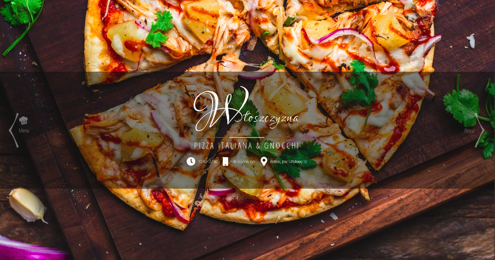
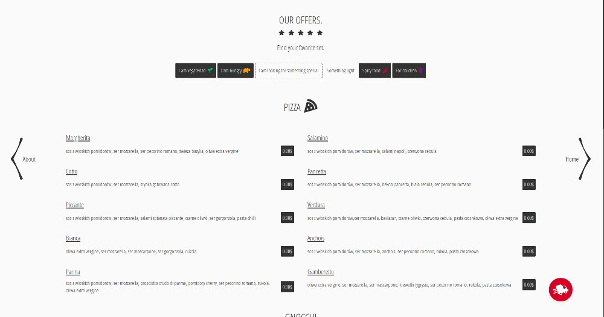
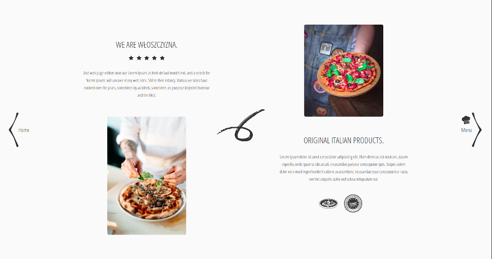

## Pizzeria (landing page)

Static web site

#### Screenshots of the app

 

  

### Demo

  https://quirky-northcutt-2862d8.netlify.app/

### Technologies

- Gatsby
- Sass
- GraphQL

## Getting started

  App requires to have node (4.x.x) and npm (2.x.x) installed.

#### Start with installing the dependencies:

  Run `npm install` to install all required packages.

#### Running:

  Use `gatsby develop` to start the dev server.
